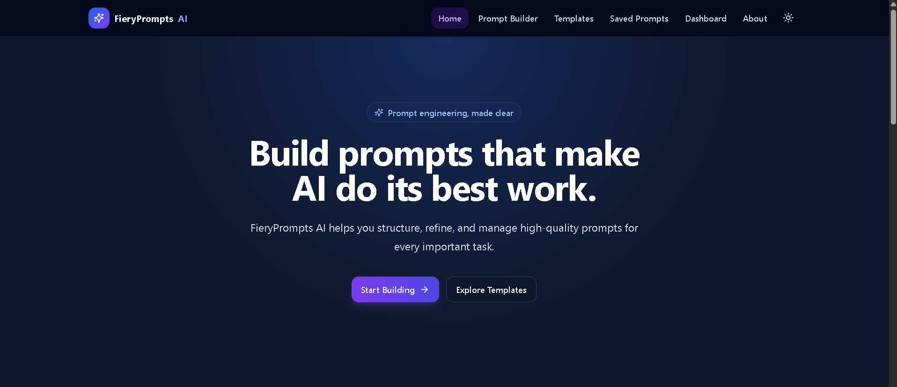
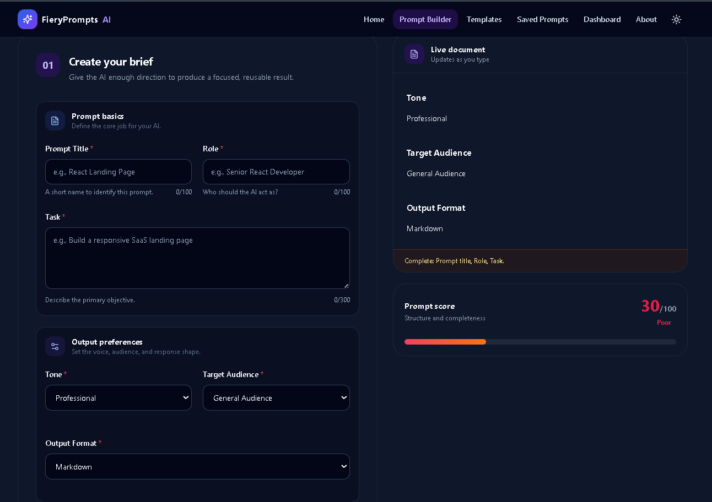
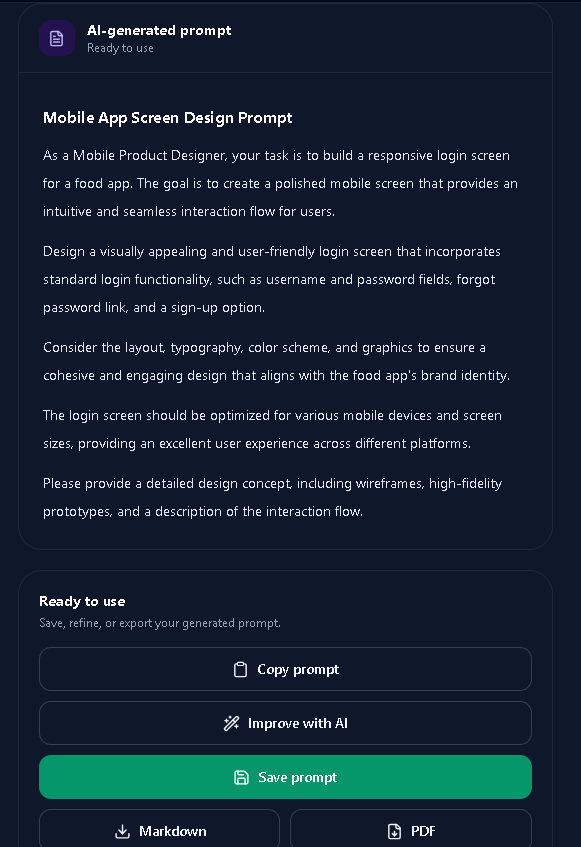
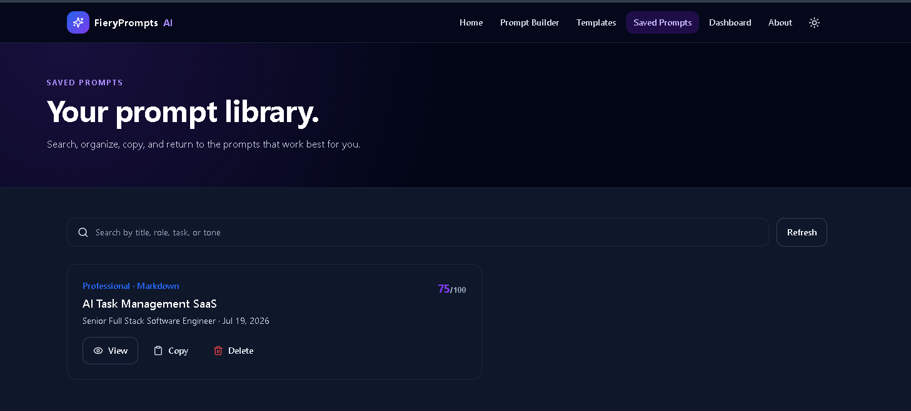
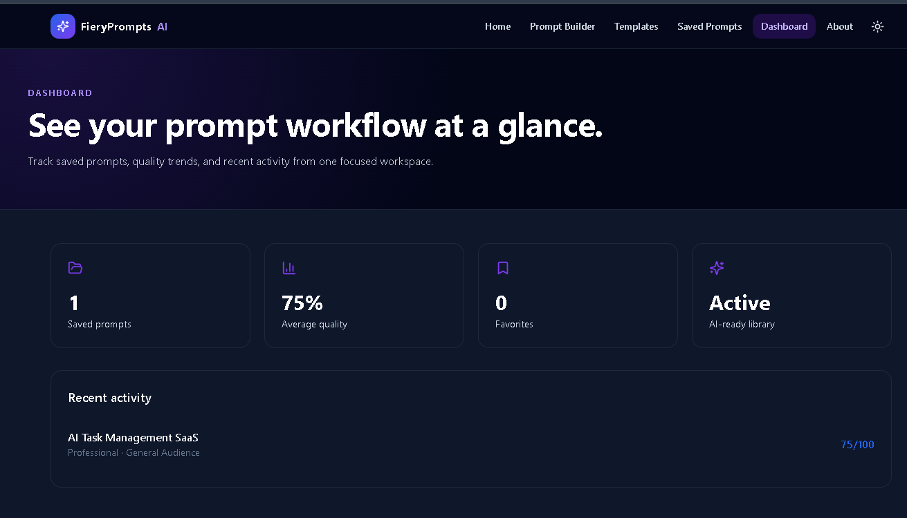

# 🔥 FieryPrompts AI

<p align="center">
  <strong>AI-Powered Prompt Engineering Platform</strong><br>
  Create, improve, organize, save, and export high-quality AI prompts with ease.
</p>

---

## 📖 Overview

FieryPrompts AI is a modern AI-powered prompt engineering platform designed to help users create well-structured, high-quality prompts for Large Language Models (LLMs). It provides an intuitive interface for prompt generation, AI-assisted improvement, prompt scoring, template management, and cloud storage using Firebase.

The platform is built with **Next.js**, **TypeScript**, **Tailwind CSS**, **Firebase**, and **Groq AI**, delivering a fast, responsive, and production-ready experience.

---

# ✨ Features

- 🤖 AI Prompt Generation
- 🧠 AI Prompt Improvement
- 📊 Prompt Quality Scoring
- ⚡ Live Prompt Preview
- 📚 Prompt Templates
- 💾 Save Prompts to Firebase
- 🗂️ View & Delete Saved Prompts
- 📄 Export Prompt as Markdown
- 📑 Export Prompt as PDF
- 📈 Dashboard & Statistics
- 📱 Fully Responsive Design
- 🌙 Modern UI

---

# 🛠 Tech Stack

| Category | Technology |
|----------|------------|
| Frontend | Next.js 15, React, TypeScript |
| Styling | Tailwind CSS |
| Backend | Next.js API Routes |
| AI | Groq API |
| Models | Llama 3.3 70B Versatile, Llama 3.1 8B Instant |
| Database | Firebase Firestore |
| Authentication | Firebase Admin SDK |
| Deployment | Vercel |

---

# 📁 Project Structure

```text
FieryPromptsAI/
│
├── app/
├── components/
├── constants/
├── docs/
├── features/
├── firebase/
├── hooks/
├── lib/
├── middleware/
├── public/
├── scripts/
├── services/
├── styles/
├── types/
├── utils/
│
├── firebase.json
├── firestore.rules
├── package.json
├── tailwind.config.ts
├── tsconfig.json
├── next.config.ts
└── README.md
```

---

# 🚀 Installation

Clone the repository

```bash
git clone https://github.com/yourusername/FieryPromptsAI.git
```

Move into the project

```bash
cd FieryPromptsAI
```

Install dependencies

```bash
npm install
```

Run locally

```bash
npm run dev
```

Open

```
https://innoviast-fiery-prompts-ai.vercel.app/
```

---

# 🔐 Environment Variables

Create a `.env.local` file and configure the following variables.

### Groq

```env
GROQ_API_KEY=
GROQ_MODEL=llama-3.3-70b-versatile
GROQ_FALLBACK_MODEL=llama-3.1-8b-instant
```

### Firebase Client

```env
NEXT_PUBLIC_FIREBASE_API_KEY=
NEXT_PUBLIC_FIREBASE_AUTH_DOMAIN=
NEXT_PUBLIC_FIREBASE_PROJECT_ID=
NEXT_PUBLIC_FIREBASE_STORAGE_BUCKET=
NEXT_PUBLIC_FIREBASE_MESSAGING_SENDER_ID=
NEXT_PUBLIC_FIREBASE_APP_ID=
```

### Firebase Admin

```env
FIREBASE_PROJECT_ID=
FIREBASE_CLIENT_EMAIL=
FIREBASE_PRIVATE_KEY=
```

---

# 📋 Usage

### Generate Prompt

1. Open Prompt Builder.
2. Fill the required fields.
3. Click **Generate Prompt**.

---

### Improve Prompt

Click **Improve with AI** to generate a more detailed version of the prompt.

---

### Save Prompt

Click **Save Prompt** to store it securely in Firebase Firestore.

---

### View Saved Prompts

Navigate to **Saved Prompts** to browse your saved prompt collection.

---

### Delete Prompt

Open a saved prompt and click **Delete**.

---

### Export

Download prompts as:

- Markdown (.md)
- PDF (.pdf)

---

# 🌐 API Routes

| Route | Method | Purpose |
|--------|--------|----------|
| `/api/generate` | POST | Generate AI Prompt |
| `/api/improve` | POST | Improve Existing Prompt |
| `/api/prompts` | GET | Fetch Saved Prompts |
| `/api/prompts` | POST | Save Prompt |
| `/api/prompts/:id` | GET | Get Prompt |
| `/api/prompts/:id` | PUT | Update Prompt |
| `/api/prompts/:id` | DELETE | Delete Prompt |

---

# 📸 Screenshots

Replace these with your project screenshots.

## 🏠 Home



---

## ✍ Prompt Builder



---

## 🤖 Generated Prompt



---

## 💾 Saved Prompts



---

## 📊 Dashboard



---

# 🔒 Security

- Firebase Admin SDK runs only on the server.
- Firestore security rules are enabled.
- Sensitive credentials are stored in environment variables.
- No secrets are committed to GitHub.

---

# 🚀 Deployment

This application is deployed on **Vercel**.

Deployment steps:

1. Push the project to GitHub.
2. Import the repository into Vercel.
3. Configure all environment variables.
4. Deploy the application.

---

# 💡 Future Improvements

- User Authentication
- Prompt Collections
- Prompt Sharing
- Version History
- Team Collaboration
- AI Chat Assistant
- Prompt Categories
- Search & Filters
- Favorites
- Analytics Dashboard

---

# 🤝 Contributing

Contributions are welcome.

1. Fork the repository.
2. Create a new branch.
3. Commit your changes.
4. Open a Pull Request.

---

# 👨‍💻 Author

**Muhammad Musa Jamil**

AI ChatBot Intern

---

⭐ If you found this project useful, consider giving it a star on GitHub.